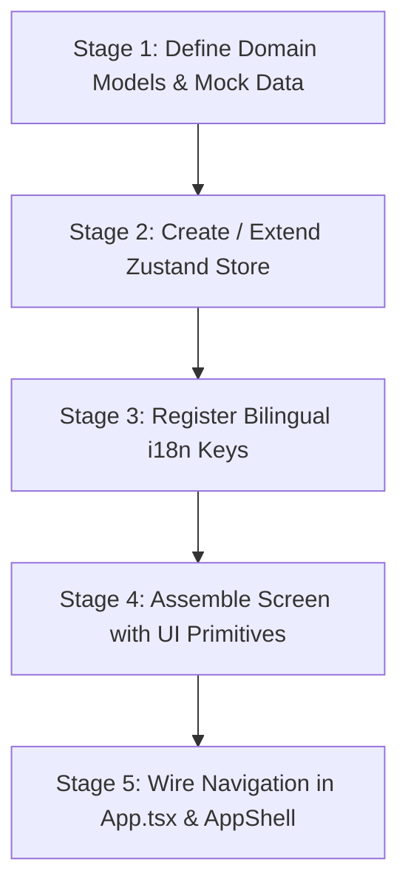

# AVELYNQ ERP — Project Structure, Component Inventory & AI UI/UX Plan

**Project:** `avelynq-erp-dashboard`  
**Purpose:** Comprehensive architectural context, component inventory, state architecture, and execution plan for AI agents to design and implement matching UI/UX features.

---

## 1. Project Overview & Tech Stack

* **Platform Name:** AVELYNQ Enterprise Resource Planning Platform (`avelynq-erp-dashboard`)
* **Core Technology Stack:**
  * **Framework:** React 18 (`react@^18.3.1`, `react-dom@^18.3.1`)
  * **Language:** TypeScript 5.9 (`typescript@^5.9.3`)
  * **Bundler & Dev Server:** Vite 5.4 (`vite@^5.4.21`, `@vitejs/plugin-react@^4.7.0`)
  * **Icon Library:** `@tabler/icons-webfont` (`^3.24.0`) — accessed via `<i className="ti ti-[name]" />`
  * **State Management:** Zustand 5.0 (`zustand@^5.0.15`)
  * **Internationalization:** Custom Bimodal English / Arabic (LTR / RTL) via React Context + CSS custom properties + `dir` attribute switching
  * **Styling Paradigm:** Pure Vanilla CSS Token Architecture (No Tailwind — relies on CSS custom properties for enterprise density and theming)

---

## 2. Codebase Directory Tree

```
dashboard_workspace/
├── index.html                               # SPA HTML entry point (Inter, Cairo, JetBrains Mono fonts)
├── package.json                             # Dependencies & scripts
├── tsconfig.json                            # TypeScript configuration
├── vite.config.ts                           # Vite bundler build config
├── public/
│   └── assets/                              # Brand logos, app icons, lockups
└── src/
    ├── App.tsx                              # Screen router & auth gatekeeper
    ├── main.tsx                             # React 18 DOM mount point with LanguageProvider wrapper
    │
    ├── assets/                              # In-bundle PNG brand assets
    │   ├── avelynq-appicon.png
    │   ├── avelynq-lockup-light.png
    │   ├── avelynq-lockup-dark.png
    │   └── avelynq-mark-dark.png
    │
    ├── context/
    │   └── LanguageContext.tsx              # English/Arabic provider managing dir="ltr"|"rtl" & t()
    │
    ├── stores/                              # Zustand State Stores
    │   ├── useAuthStore.ts                  # Session & auth state (isAuthenticated, user, login, logout)
    │   ├── useNavigationStore.ts            # Screen router state (currentScreen, setCurrentScreen)
    │   ├── useAccountsStore.ts              # General ledger accounts state & filters
    │   ├── useOrganizationStore.ts          # Org Units tree, Departments, Job Titles, Positions
    │   └── useLanguageStore.ts              # Translation dictionary (en / ar) & locale switch
    │
    ├── styles/                              # Design Token CSS System
    │   ├── styles.css                       # Global reset, typography, and utility rules
    │   └── tokens/
    │       ├── colors.css                   # Navy foundation, Blue trust, Teal ascent, Slate neutrals
    │       ├── typography.css               # Font sizes (h1-h4, body, caption, code) & font families
    │       ├── spacing.css                  # Heights (--control-sm/md/lg), gaps, and padding tokens
    │       ├── elevation.css                # Box shadows (--shadow-xs/sm/md/lg), z-index, radii
    │       ├── breakpoints.css              # Viewport media queries
    │       ├── fonts.css                    # Font family mappings
    │       └── responsive.css               # Mobile layout rules and breakpoints
    │
    ├── components/
    │   └── ui/                              # Design System Reusable Atomic Primitives
    │       ├── Button.tsx                   # Button (6 variants, 3 sizes, loading) & IconButton
    │       ├── FormControls.tsx             # Input, Select, Checkbox, Switch
    │       ├── DataDisplay.tsx              # Card, Stat (KPI), Badge, Avatar
    │       └── OverlaysAndFeedback.tsx      # Alert, EmptyState, Tabs, Breadcrumb, Dialog, Drawer
    │
    ├── data/
    │   └── mockData.ts                      # Domain types & default mock datasets
    │
    └── pages/                               # Application Screens
        ├── Login.tsx                        # Enterprise Auth Screen
        ├── Dashboard.tsx                    # Executive KPI Telemetry & Audit Stream
        ├── Organization.tsx                 # Business Units Tree, Dept Registry, Job Titles Matrix
        ├── Accounts.tsx                     # General Ledger Chart of Accounts Browser & Drawer
        ├── AccountForm.tsx                  # Multi-step Account Registration Form
        └── GenericModule.tsx                # Dynamic Shell for HR, Inventory, Procurement, Sales, etc.
```

---

## 3. What is Already Implemented

| Screen / Feature | Route ID (`currentScreen`) | Key Functionality & State Handling |
| :--- | :--- | :--- |
| **Authentication Shell** | `login` | Login page with credential inputs, remember-me checkbox, instant language toggle, brand lockup, error states, and session persistence in `useAuthStore`. |
| **Executive Dashboard** | `dashboard` | Financial telemetry (Total Assets, Working Capital, Active Departments, Headcount), pending approvals queue, audit log activity stream, quick navigation shortcuts. |
| **Chart of Accounts** | `accounts` | Hierarchical General Ledger table, search by code/name, filter by account type (`Asset`, `Liability`, `Equity`, `Revenue`, `Expense`), detail slide-over `Drawer`. |
| **Account Creation** | `account-form` | Multi-step form with code generator, category dropdown, currency selector, reconciliation toggle, and live validation. |
| **Organization Workspace** | `organization` | 4-tab workspace (`Departments`, `Job Titles`, `Positions`, `Org Units Tree`) with interactive node selection, search filtering, and create modal dialogs. |
| **Enterprise Shell Modules** | `human-resources`<br>`inventory`<br>`procurement`<br>`sales`<br>`maintenance`<br>`security`<br>`reports` | Generic high-density module shells using `GenericModule.tsx` with action cards, icons, and empty states ready for sub-feature expansion. |
| **App Layout Frame** | `AppShell` | Collapsible multi-section sidebar with active markers and counters, topbar with global search, notifications counter, language selector, and responsive mobile drawer. |
| **Localization & RTL** | `LanguageContext` | Instant bilingual English (`en`, LTR) <-> Arabic (`ar`, RTL) switching modifying `document.documentElement.dir` and translating UI keys via `t()`. |

---

## 4. Reusable Component Inventory

All components are located in `src/components/ui/`. **Do NOT create raw unstyled HTML elements; use these primitives:**

### Action Elements (`src/components/ui/Button.tsx`)
* **`Button`**:
  * Props: `variant` (`'primary'` | `'accent'` | `'secondary'` | `'ghost'` | `'danger'` | `'inverse'`), `size` (`'sm'` | `'md'` | `'lg'`), `loading`, `iconLeft`, `iconRight`, `block`, `disabled`, `onClick`.
* **`IconButton`**:
  * Props: `icon` (`string` icon class), `label`, `variant`, `size`, `disabled`, `onClick`.

### Form Controls (`src/components/ui/FormControls.tsx`)
* **`Input`**:
  * Props: `label`, `hint`, `error`, `iconLeft`, `suffix`, `mono`, `required`, `value`, `onChange`, `placeholder`, `disabled`.
* **`Select`**:
  * Props: `label`, `hint`, `error`, `options` (Array of `{ label: string, value: string }`), `iconLeft`, `required`, `value`, `onChange`.
* **`Checkbox`**:
  * Props: `label`, `description`, `checked`, `onChange`, `disabled`.
* **`Switch`**:
  * Props: `label`, `checked`, `onChange`, `disabled`.

### Data Display (`src/components/ui/DataDisplay.tsx`)
* **`Card`**:
  * Props: `title`, `subtitle`, `action` (`ReactNode`), `variant` (`'default'` | `'flat'` | `'raised'`), `padding` (`'none'` | `'sm'` | `'md'` | `'lg'`), `children`.
* **`Stat`**:
  * Props: `label`, `value`, `change`, `changeType` (`'positive'` | `'negative'` | `'neutral'`), `icon`, `trendText`.
* **`Badge`**:
  * Props: `variant` (`'primary'` | `'accent'` | `'success'` | `'warning'` | `'danger'` | `'neutral'` | `'ghost'`), `size` (`'sm'` | `'md'`), `dot` (`boolean`), `children`.
* **`Avatar`**:
  * Props: `name`, `src`, `size` (`'xs'` | `'sm'` | `'md'` | `'lg'`), `status` (`'online'` | `'offline'` | `'away'`).

### Overlays & Feedback (`src/components/ui/OverlaysAndFeedback.tsx`)
* **`Alert`**:
  * Props: `variant` (`'info'` | `'success'` | `'warning'` | `'danger'`), `title`, `children`, `onClose`.
* **`EmptyState`**:
  * Props: `icon`, `title`, `description`, `action` (`ReactNode`).
* **`Tabs`**:
  * Props: `items` (Array of `{ id: string, label: string, icon?: string, badge?: string | number }`), `activeId`, `onChange`, `variant` (`'underline'` | `'pills'`).
* **`Breadcrumb`**:
  * Props: `items` (Array of `{ label: string, href?: string, onClick?: () => void }`), `separator`.
* **`Dialog`**:
  * Props: `isOpen`, `onClose`, `title`, `children`, `footer` (`ReactNode`), `width`.
* **`Drawer`**:
  * Props: `isOpen`, `onClose`, `title`, `children`, `width`.

---

## 5. Design System Tokens & Styling Rules

All styling must reference CSS custom properties defined in `src/styles/tokens/`:

### Key Color Variables
* **Brand Foundation (Navy):** `--navy-950` (`#030814`), `--navy-900` (`#060E1E`), `--navy-850` (`#0A1628`)
* **Brand Primary (Trust Blue):** `--brand-primary` (`#2466D8`), `--brand-primary-hover` (`#1B54BC`)
* **Brand Accent (Ascent Teal):** `--brand-accent` (`#12A99B`), `--brand-accent-hover` (`#0E8C80`)
* **Surfaces:** `--surface-page` (`#F8FAFC`), `--surface-card` (`#FFFFFF`), `--surface-sunken` (`#F1F5F9`)
* **Borders:** `--border-default` (`#B7C3D1`), `--border-subtle` (`#E6ECF3`)
* **Status Colors:** `--green-500` (`#1F9D5F`), `--amber-500` (`#C77D11`), `--red-500` (`#CB3A2D`), `--blue-500` (`#2466D8`)

### Spacing & Sizing
* **Control Heights:** `--control-sm` (`32px`), `--control-md` (`38px`), `--control-lg` (`44px`)
* **Border Radii:** `--radius-sm` (`4px`), `--radius-md` (`7px`), `--radius-lg` (`10px`), `--radius-full` (`9999px`)
* **Shadows:** `--shadow-xs`, `--shadow-sm`, `--shadow-md`, `--shadow-lg`

### RTL & Logical Properties Rule
* **Mandatory:** Always use CSS logical properties for spacing to guarantee automatic RTL support:
  * `margin-inline-start` / `margin-inline-end` (instead of `margin-left` / `margin-right`)
  * `padding-inline-start` / `padding-inline-end` (instead of `padding-left` / `padding-right`)
  * `border-inline-start` / `border-inline-end` (instead of `border-left` / `border-right`)
  * `inset-inline-start` / `inset-inline-end` (instead of `left` / `right`)
  * `text-align: start` (instead of `text-align: left`)

---

## 6. AI Agent Prompt Template

Copy and paste the prompt below to assign UI/UX and feature creation tasks to an AI agent:

```markdown
You are an expert Frontend Architect and UI/UX Engineer specialized in building enterprise-grade React web applications.

You are working on the "AVELYNQ ERP Dashboard" repository (`avelynq-erp-dashboard`).

### ARCHITECTURAL RULES & CONSTRAINTS:
1. Tech Stack: React 18, TypeScript 5.9, Zustand 5, Vite, `@tabler/icons-webfont` (`ti ti-*`), and Vanilla CSS Design Tokens. Do not install Tailwind.
2. Component Reuse: NEVER write unstyled or raw HTML buttons, inputs, modals, or badges. You must import and compose primitives from `src/components/ui/`:
   - `Button`, `IconButton` from `src/components/ui/Button`
   - `Input`, `Select`, `Checkbox`, `Switch` from `src/components/ui/FormControls`
   - `Card`, `Stat`, `Badge`, `Avatar` from `src/components/ui/DataDisplay`
   - `Tabs`, `Breadcrumb`, `Alert`, `EmptyState`, `Dialog`, `Drawer` from `src/components/ui/OverlaysAndFeedback`
3. Design System Tokens: Always reference CSS variables (`var(--brand-primary)`, `var(--surface-card)`, `var(--border-default)`, `var(--shadow-sm)`, etc.).
4. Bimodal English & Arabic (LTR/RTL):
   - Use CSS logical properties (`margin-inline-start`, `padding-inline-start`, `inset-inline-end`, `text-align: start`).
   - Register all UI text keys in `src/stores/useLanguageStore.ts` under both `translations.en` and `translations.ar`.
   - Access translations in components using `const { t, lang } = useLanguage();`.
5. State Management:
   - Persist application data, lists, filters, and selections in Zustand stores under `src/stores/`.
   - Use local component `useState` strictly for ephemeral UI state (e.g. form inputs inside a modal, toggle popovers).
6. Routing & Navigation:
   - Register new screen keys in `src/stores/useNavigationStore.ts`.
   - Render page views inside `src/App.tsx` wrapped by `src/layout/AppShell.tsx`.
   - Add sidebar links in `src/layout/Sidebar.tsx`.

### FEATURE ASSIGNMENT:
[INSERT YOUR SPECIFIC SCREEN OR WORKFLOW REQUIREMENT HERE]
Example: "Implement the Inventory Stock Management screen with warehouse filters, low-stock badges, stock transfer modal dialog, and item detail drawer."

### DELIVERABLE REQUIREMENTS:
1. Provide/update TypeScript models and mock dataset in `src/data/mockData.ts`.
2. Provide/update Zustand store in `src/stores/`.
3. Add required bilingual translation keys to `src/stores/useLanguageStore.ts`.
4. Implement the page component in `src/pages/<PageName>.tsx`.
5. Connect navigation in `src/App.tsx` and `src/layout/Sidebar.tsx`.
```

---

## 7. Feature Execution Plan

Follow these 5 distinct stages whenever adding or refining features:



### Stage 1: Define Domain Models & Mock Data
* File: `src/data/mockData.ts`
* Declare clean TypeScript interfaces with strict typing.
* Populate realistic bilingual mock items (e.g. `nameEn`, `nameAr`, codes, statuses, monetary balances).

### Stage 2: Create / Extend Zustand Store
* File: `src/stores/use<Feature>Store.ts`
* Setup state slices for:
  * Entities list (loaded from mock data)
  * Active filters (search query, category filter, status filter, date ranges)
  * Selected entity for inspection in `Drawer`
  * Modal dialog visibility flags
  * Mutation actions (add item, edit item, delete item, update status)

### Stage 3: Register Bilingual Translation Keys
* File: `src/stores/useLanguageStore.ts`
* Ensure 100% parity between `translations.en` and `translations.ar` dictionaries for all labels, table headers, actions, tooltips, and empty-state placeholders.

### Stage 4: Assemble Screen with UI Primitives
* File: `src/pages/<FeatureName>.tsx`
* Layout hierarchy:
  1. **Header Bar:** Breadcrumb, Title `<h1>`, Primary action `Button` with icon.
  2. **Telemetry Summary:** Row of 3–4 `Stat` KPI cards.
  3. **Filter & Search Bar:** `Input` (search with `ti-search`), `Select` filters, `IconButton` for view toggling.
  4. **Data Grid / Table:** `Card` wrapper containing clean enterprise data table with `Badge` status indicators.
  5. **Detail Drawer:** `Drawer` for side-panel detail inspection.
  6. **Create / Edit Dialog:** `Dialog` containing structured `Input`, `Select`, `Checkbox` fields.
  7. **Empty State:** `EmptyState` displayed when queries return no matching records.

### Stage 5: Wire Navigation & AppShell
* Files: `src/stores/useNavigationStore.ts`, `src/App.tsx`, `src/layout/Sidebar.tsx`
* Add screen identifier to `ScreenType` union.
* Add title and breadcrumb resolvers in `App.tsx`.
* Add navigation item to `Sidebar.tsx` with appropriate section grouping and Tabler icon.
